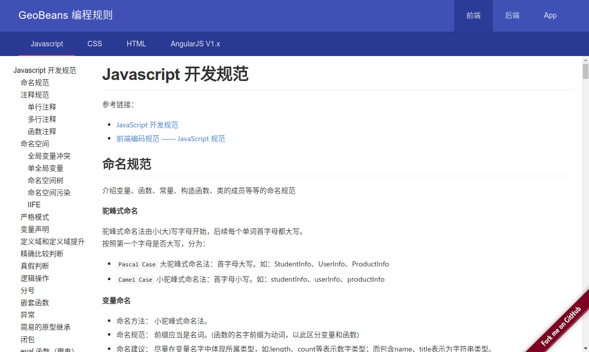

# Geobeans 编程规则

为了方便大家更好的编写代码，由我为大家整理了一份`前端` ,`后端`, `APP`的一系列规范，此规范会一直处于更新维护状态。

在线地址：[http://rule.ciyuer.com](http://rule.ciyuer.com)

**如果有志同道合的朋友也欢迎加入规则的编写，让我们的规则更丰富。**

此站点使用`ReactJS`进行开发，规则文档使用`Markdown`语法进行编写。

所有的规则文件存放在以下目录：

```shell
/public/docs
```

现有的规则如下：

- [HTML 开发规范](./public/docs/front/html.md)
- [Javascript 开发规范](./public/docs/front/javascript.md)
- [CSS 开发规范](./public/docs/front/css.md)
- [Angular1.x 开发规范](./public/docs/front/angular-v1.md)
- [Java 开发规范](./public/docs/backend/java.md)
- [Android 开发规范](./public/docs/app/android.md)


## 如何使用？

```shell

# 克隆项目
git clone https://github.com/DennisGuo/geobeans-programming-rule.git

# 进入目录
cd geobeans-programming-rule

# 安装依赖
npm install

# 运行项目
npm start

# 如果需要线上发布，使用以下命令构建, 构建之后会创建 /build 目录
npm run build

```

### 效果图



### 更新说明

**2017-02-15**
- 移除`redux-logger`
- 增加[not-support-ie-alert](https://github.com/DennisGuo/not-support-ie-alert),提示不支持IE9-

**2017-02-14**
- 增加了前端和android的规范文档
- 增加了Google Analysis脚本统计访问
- 兼容到IE10，修复导航栏问题

**2017-02-07**
- 增加了首页的新闻列表
- 使用`jenkins`进行项目自动部署到[http://rule.ciyuer.com](http://rule.ciyuer.com)